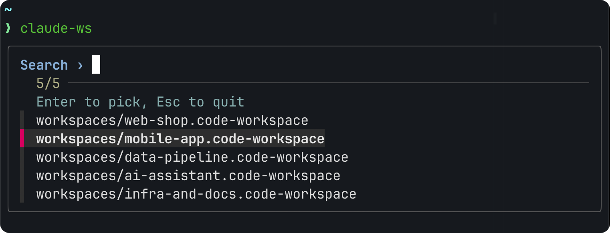

<div align="center">

# 🪄 Claude Workspace

[](LICENSE)
[](https://claude.com/claude-code)
[](#)
[](#)

**Pick a workspace, and the Claude Code CLI opens with all its folders and context attached.**
<br>
**Full context:** loads the `CLAUDE.md` of every folder.
<br>
**VS Code–friendly:** reuses `.code-workspace` files you already have — no new format to learn.

<br>



<br>

</div>

---

## 💡 What is this

`claude-ws` is a single zsh function that sits next to `claude`. Run it, pick a workspace from a menu, and `claude` boots up in the right folder with every other folder already attached via `--add-dir`. No config files to maintain, no manual `--add-dir` typing, no touching `claude` itself.

It's VS Code–friendly by design: it reads the exact `.code-workspace` JSON files VS Code already uses for multi-root projects, so if you're already organizing work that way, `claude-ws` just plugs in — no separate config format to keep in sync. VS Code itself is not required.

## ⚙️ How it works

1. Lists the `*.code-workspace` files in your workspace folder, newest first.
2. Shows an arrow-key picker (fzf) with search.
3. Reads the folder list from the chosen file with `jq`.
4. Starts `claude` in the first folder and adds the rest with `--add-dir`.

**The first folder is the "home" of the session.** Claude works there by default, and the session itself — its history and memory (auto memory, `/resume`) — belongs to that folder. The other folders are attached as extra context: Claude can read and edit them, but nothing session-related is stored there. So put the folder you work in most (or where you want Claude's notes to live) first in the `folders` list.

## 📋 Requirements

- macOS + zsh
- [`jq`](https://stedolan.github.io/jq/)
- [`fzf`](https://github.com/junegunn/fzf)
- The official `claude` CLI

## 📦 Install

```bash
brew install jq fzf

git clone https://github.com/paulmorphic/claude-workspace.git
cd claude-workspace
./install.sh
```

The installer adds `claude-ws` to `~/.zshrc` (safe to re-run; every run first saves a copy as `~/.zshrc.bak-claude-ws-<date>-<time>`). Don't edit or remove the `# >>> claude-ws` / `# <<< claude-ws` marker lines — install and uninstall rely on them.

Then tell it where your `.code-workspace` files are — add to `~/.zshrc` the folder that holds them (subfolders are not searched). Separate several folders with `:`:

```bash
export CLAUDE_WORKSPACE_DIRS="/path/to/workspaces:/another/folder"
```

Reload with `source ~/.zshrc` or open a new terminal.

## 🚀 Usage

```bash
claude-ws
```

Type to filter, Enter to launch. Extra arguments pass straight through to `claude`:

```bash
claude-ws --model haiku
```

A workspace file, e.g. `/path/to/workspaces/my-app.code-workspace`:

```json
{
  "folders": [
    { "path": "~/code/project-a" },
    { "path": "/Users/me/work/project-b" }
  ]
}
```

Paths can be absolute, `~/…`, or relative to the file (like in VS Code). Or create the file with VS Code: **File → Save Workspace As…**

## 📝 Good to know

- `CLAUDE.md` and `.claude/rules` of every folder in the workspace are loaded, not just the first (`claude-ws` sets `CLAUDE_CODE_ADDITIONAL_DIRECTORIES_CLAUDE_MD=1`; plain `--add-dir` doesn't).
- ⚠️ Loading all those files adds to the context of every session, so **token usage can go up** — noticeably with many folders or large `CLAUDE.md` files. To turn it off, add `export CLAUDE_CODE_ADDITIONAL_DIRECTORIES_CLAUDE_MD=0` to `~/.zshrc`.
- This is Claude Code behavior defined by Anthropic, so it may change independently of this tool. See the docs: [Memory → Load from additional directories](https://code.claude.com/docs/en/memory#load-from-additional-directories) and [Environment variables](https://code.claude.com/docs/en/env-vars).
- Workspace files are trusted: their folders are added without a prompt. Keep only files you trust in `CLAUDE_WORKSPACE_DIRS`; the added folders are printed before launch.

## 🧹 Uninstall

```bash
cp ~/.zshrc ~/.zshrc.bak                                          # safety copy
sed -i '' '/^# >>> claude-ws (/,/^# <<< claude-ws (/d' ~/.zshrc   # remove the block
```

Then delete the `CLAUDE_WORKSPACE_DIRS` export line you added.

## 📄 License

[MIT](LICENSE) — do whatever you want with it, just keep the notice.
